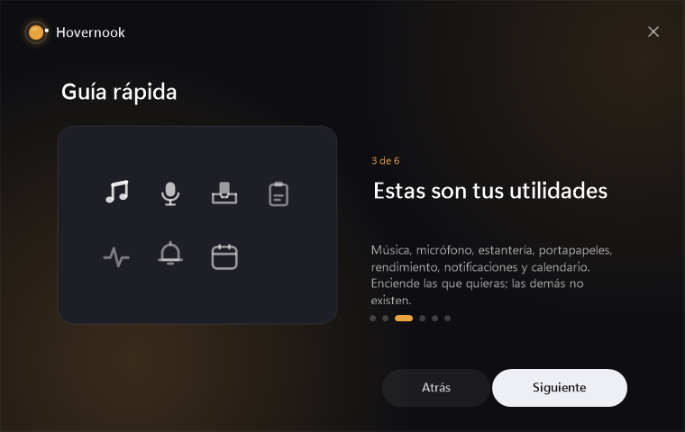
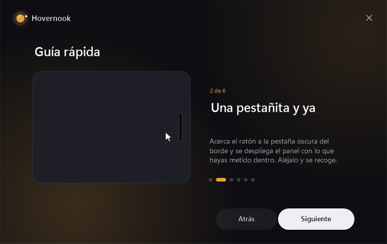
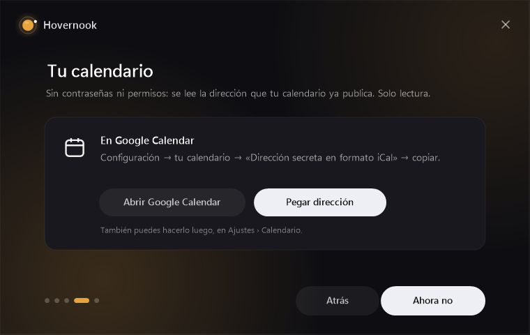

# Hovernook

Utilidades pequeñas que viven en el borde de la pantalla y te ayudan sin molestar.
*Tiny Windows companions that live on the edge of your screen and help without getting in the way.*

**[⬇ Descargar la última versión](https://github.com/hovernook/hovernook/releases/latest/download/HovernookSetup.exe)** · Windows 10 y 11 · no necesita nada más instalado

## Qué trae

| | |
|---|---|
| **Música** | Controles de Spotify y del navegador, portada, letra sincronizada, volumen del sistema y de la app, y elegir por dónde suena. |
| **Micrófono** | Silencia el micro y, si usas Discord, silencia también el suyo. Te avisa si hablas estando en silencio, y enseña quién está en la llamada. |
| **Estantería** | Arrastra archivos o texto al borde, quedan ahí un rato, y los sueltas donde quieras. |
| **Portapapeles** | Todo lo que copias, a mano. Pega con un clic, fija lo que uses mucho, guarda como archivo. |
| **Rendimiento** | CPU, memoria, gráfica, red, disco y temperaturas, y qué apps se lo están comiendo. |
| **Notificaciones** | Lo que te avisa (WhatsApp, correo, Slack…) en un sitio, con filtros por app y no molestar. |
| **Calendario** | Lo siguiente que tienes, con cuenta atrás, vista de semana y mes, y un aviso con botón de *Unirse* diez minutos antes. |

Enciendes las que quieras; las demás no existen.

## Cómo se usa

Todo vive en una **pestañita** en el borde de la pantalla. Acercas el ratón y se despliega el panel con lo que hayas metido dentro; lo alejas y se recoge. Puedes arrastrarlo a cualquiera de los cuatro bordes, y si arrastras un archivo hacia él se convierte en la estantería para soltarlo ahí.

En **Ajustes › Apariencia** montas tu panel arrastrando: metes dentro las utilidades que quieras, en el orden que quieras, cada una entera o en pequeño, y las demás se quedan en el borde con su burbuja.

`Ctrl+Mayús+Alt+Espacio` abre el panel sin apuntar con el ratón. Cada utilidad tiene sus propios atajos, configurables.

## El calendario

Sin contraseñas y sin dar permisos a nadie: se pega la **dirección secreta en formato iCal** que tu calendario ya publica.

- **Google Calendar** → Configuración → tu calendario → *Dirección secreta en formato iCal* → copiar.
- **Outlook** → Configuración → Calendario → Calendarios compartidos → Publicar → ICS.
- **Notion** y **Apple** también publican una.

Se pega en el instalador o en Ajustes › Calendario, y es **solo lectura**: Hovernook enseña tu agenda, nunca la toca.

## Privacidad

**Nada sale de tu ordenador.** No hay cuentas, ni servidor, ni telemetría. Las notificaciones se leen con la API de Windows y se quedan en memoria; el calendario se descarga directamente desde la dirección que tú pegas; tus ajustes viven en `%LOCALAPPDATA%\Hovernook`. Lo único que Hovernook pide a internet es mirar si hay una versión nueva en esta misma página.

## Instalar y actualizar

Descarga `HovernookSetup.exe`, ábrelo y elige qué quieres. Se instala para tu usuario (`%LOCALAPPDATA%\Programs\Hovernook`), sin permisos de administrador.

Windows puede enseñar el aviso azul de *SmartScreen* porque el instalador no está firmado: **Más información → Ejecutar de todas formas**.

Cuando haya una versión nueva te avisa solo, y tus preferencias se quedan como las tenías. Lo que cambia en cada una está en [CHANGELOG.md](CHANGELOG.md) y dentro de la app, en **Ajustes › Novedades**.

Si algo va raro, abre un *issue* contando qué hacías: la app deja un registro en `%LOCALAPPDATA%\Hovernook\problems.log` que ayuda bastante.

---

© 2026 Hovernook. Todos los derechos reservados. El programa se comparte para usarlo tal cual; no se publica su código y no se permite redistribuirlo, modificarlo ni venderlo.

*All rights reserved. Hovernook is shared to be used as it is; the source is not published, and redistributing, modifying or selling it is not allowed.*
